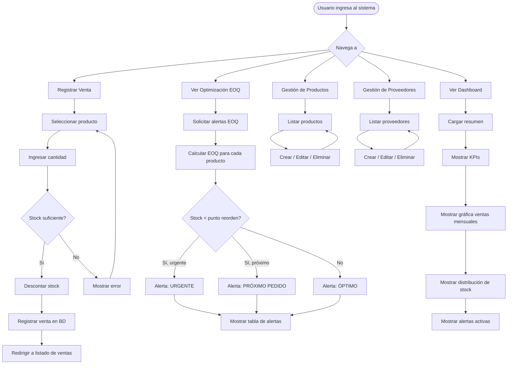

# Diagrama de actividades — Registro de venta y optimización EOQ

```mermaid
flowchart TD
    A([Usuario ingresa al sistema]) --> B{Navega a}
    B --> C[Gestión de Productos]
    B --> D[Gestión de Proveedores]
    B --> E[Registrar Venta]
    B --> F[Ver Dashboard]
    B --> G[Ver Optimización EOQ]

    E --> H[Seleccionar producto]
    H --> I[Ingresar cantidad]
    I --> J{Stock suficiente?}
    J -->|Sí| K[Descontar stock]
    J -->|No| L[Mostrar error]
    L --> H
    K --> M[Registrar venta en BD]
    M --> N[Redirigir a listado de ventas]

    G --> O[Solicitar alertas EOQ]
    O --> P[Calcular EOQ para cada producto]
    P --> Q{Stock < punto reorden?}
    Q -->|Sí, urgente| R[Alerta: URGENTE]
    Q -->|Sí, próximo| S[Alerta: PRÓXIMO PEDIDO]
    Q -->|No| T[Alerta: ÓPTIMO]
    R --> U[Mostrar tabla de alertas]
    S --> U
    T --> U

    F --> V[Cargar resumen]
    V --> W[Mostrar KPIs]
    W --> X[Mostrar gráfica ventas mensuales]
    X --> Y[Mostrar distribución de stock]
    Y --> Z[Mostrar alertas activas]

    C --> C1[Listar productos]
    C1 --> C2[Crear / Editar / Eliminar]
    C2 --> C1

    D --> D1[Listar proveedores]
    D1 --> D2[Crear / Editar / Eliminar]
    D2 --> D1
```
