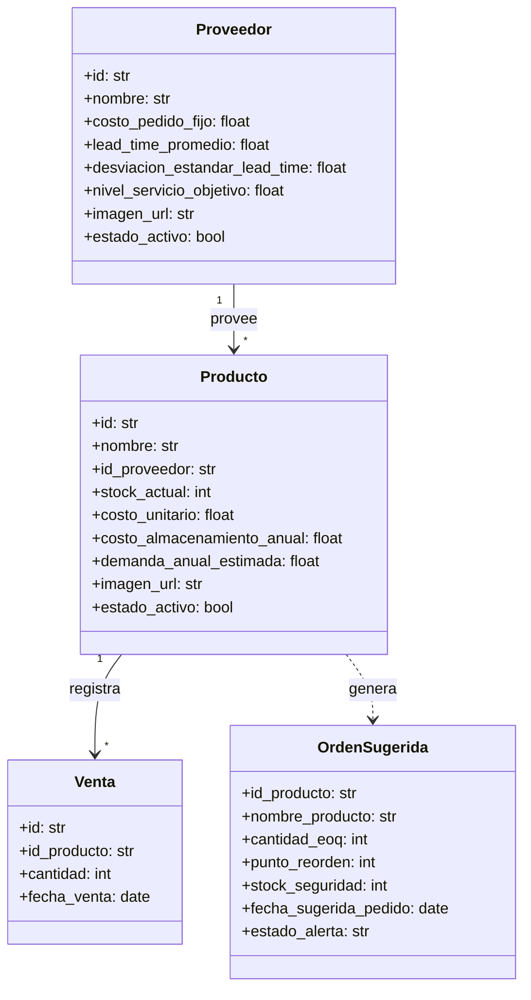

# Diagrama de clases

```mermaid
classDiagram
    class Proveedor {
        +id: str
        +nombre: str
        +costo_pedido_fijo: float
        +lead_time_promedio: float
        +desviacion_estandar_lead_time: float
        +nivel_servicio_objetivo: float
        +imagen_url: str
        +estado_activo: bool
    }

    class Producto {
        +id: str
        +nombre: str
        +id_proveedor: str
        +stock_actual: int
        +costo_unitario: float
        +costo_almacenamiento_anual: float
        +demanda_anual_estimada: float
        +imagen_url: str
        +estado_activo: bool
    }

    class Venta {
        +id: str
        +id_producto: str
        +cantidad: int
        +fecha_venta: date
    }

    class OrdenSugerida {
        +id_producto: str
        +nombre_producto: str
        +cantidad_eoq: int
        +punto_reorden: int
        +stock_seguridad: int
        +fecha_sugerida_pedido: date
        +estado_alerta: str
    }

    Proveedor "1" --> "*" Producto : provee
    Producto "1" --> "*" Venta : registra
    Producto ..> OrdenSugerida : genera
```
