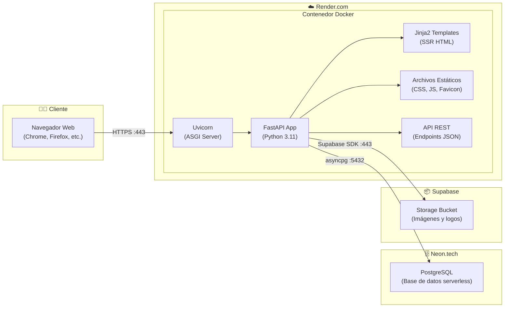

# Diagrama de despliegue

```mermaid
flowchart LR
    subgraph Cliente["🧑‍💻 Cliente"]
        Navegador["Navegador Web<br/>(Chrome, Firefox, etc.)"]
    end

    subgraph Render["☁️ Render.com"]
        subgraph Docker["Contenedor Docker"]
            Uvicorn["Uvicorn<br/>(ASGI Server)"]
            FastAPI["FastAPI App<br/>(Python 3.11)"]
            Jinja2["Jinja2 Templates<br/>(SSR HTML)"]
            Static["Archivos Estáticos<br/>(CSS, JS, Favicon)"]
            API["API REST<br/>(Endpoints JSON)"]
        end
    end

    subgraph Neon["🗄️ Neon.tech"]
        PostgreSQL["PostgreSQL<br/>(Base de datos serverless)"]
    end

    subgraph Supabase["📦 Supabase"]
        Storage["Storage Bucket<br/>(Imágenes y logos)"]
    end

    Navegador -->|HTTPS :443| Uvicorn
    Uvicorn --> FastAPI
    FastAPI --> Jinja2
    FastAPI --> Static
    FastAPI --> API
    FastAPI -->|asyncpg :5432| PostgreSQL
    FastAPI -->|Supabase SDK :443| Storage
```
