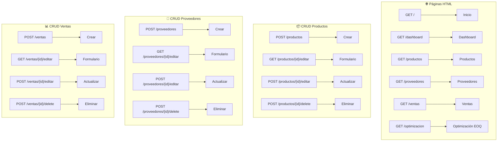
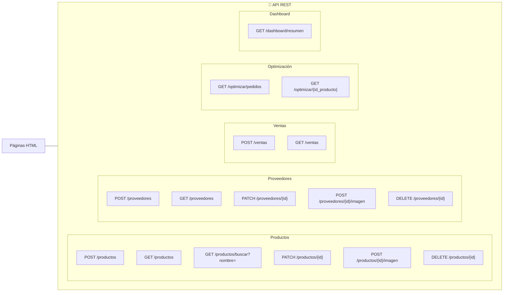

# Diagrama de endpoints

## Rutas SSR (Server-Side Rendering)

```mermaid
flowchart TD
    subgraph Pages["🌐 Páginas HTML"]
        I["GET /"] --> IN[Inicio]
        D["GET /dashboard"] --> DB[Dashboard]
        P["GET /productos"] --> PL[Productos]
        PR["GET /proveedores"] --> PV[Proveedores]
        V["GET /ventas"] --> VT[Ventas]
        O["GET /optimizacion"] --> OP[Optimización EOQ]
    end

    subgraph ProductosCRUD["📦 CRUD Productos"]
        PC["POST /productos"] --> PCreate[Crear]
        PE["GET /productos/{id}/editar"] --> PEditF[Formulario]
        PU["POST /productos/{id}/editar"] --> PEdit[Actualizar]
        PD["POST /productos/{id}/delete"] --> PDel[Eliminar]
    end

    subgraph ProveedoresCRUD["🏢 CRUD Proveedores"]
        PRC["POST /proveedores"] --> PRCreate[Crear]
        PRE["GET /proveedores/{id}/editar"] --> PREditF[Formulario]
        PRU["POST /proveedores/{id}/editar"] --> PREdit[Actualizar]
        PRD["POST /proveedores/{id}/delete"] --> PRDel[Eliminar]
    end

    subgraph VentasCRUD["📊 CRUD Ventas"]
        VC["POST /ventas"] --> VCreate[Crear]
        VE["GET /ventas/{id}/editar"] --> VEditF[Formulario]
        VU["POST /ventas/{id}/editar"] --> VEdit[Actualizar]
        VD["POST /ventas/{id}/delete"] --> VDel[Eliminar]
    end
```

## API REST

```mermaid
flowchart LR
    subgraph REST["🔌 API REST"]
        direction LR

        subgraph ProdAPI["Productos"]
            P1["POST /productos"]
            P2["GET /productos"]
            P3["GET /productos/buscar?nombre="]
            P4["PATCH /productos/{id}"]
            P5["POST /productos/{id}/imagen"]
            P6["DELETE /productos/{id}"]
        end

        subgraph ProvAPI["Proveedores"]
            R1["POST /proveedores"]
            R2["GET /proveedores"]
            R3["PATCH /proveedores/{id}"]
            R4["POST /proveedores/{id}/imagen"]
            R5["DELETE /proveedores/{id}"]
        end

        subgraph VentAPI["Ventas"]
            S1["POST /ventas"]
            S2["GET /ventas"]
        end

        subgraph OptAPI["Optimización"]
            O1["GET /optimizar/pedidos"]
            O2["GET /optimizar/{id_producto}"]
        end

        subgraph DashAPI["Dashboard"]
            DS1["GET /dashboard/resumen"]
        end
    end

    SSR["Páginas HTML"] --- REST
```
